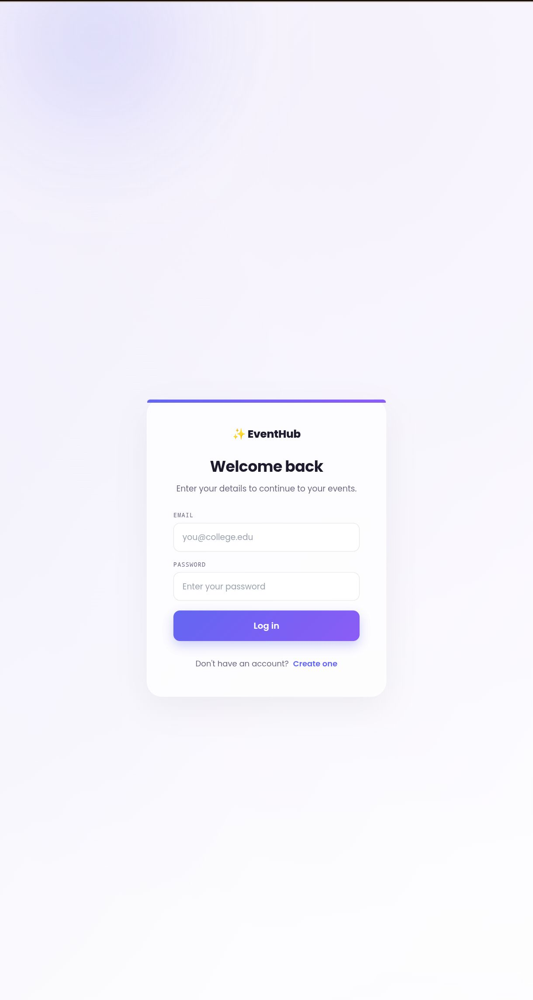
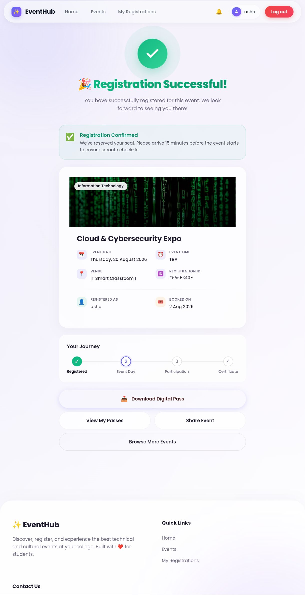
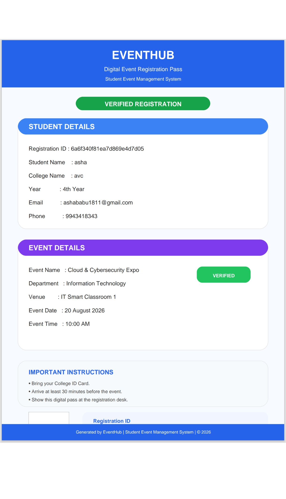

# Student Event Management System

A full-stack web application designed to simplify college event management by allowing students to explore events, register for events, and manage their participation efficiently.

---

## 🚀 Deployment

### Frontend
- React + Vite
- Deployed on Netlify

### Backend
- Node.js + Express
- Deployed on Render

### Database
- MongoDB Atlas

### 🌐 Live Demo

- **Frontend:** https://event-hub-app.netlify.app/
- **Backend:**https://student-event-management-system.onrender.com/api

---

## ✨ Features

- User Registration & Login
- JWT Authentication
- Browse Upcoming College Events
- Search & Filter Events by Department
- Event Registration System
- Prevent Duplicate Registrations
- View Registered Events
- Responsive Modern UI
- Admin Event Management (CRUD)

---

## 🛠️ Tech Stack

### Frontend
- React.js
- HTML5
- CSS3
- JavaScript
- Axios

### Backend
- Node.js
- Express.js

### Database
- MongoDB Atlas
- Mongoose

### Tools
- Git & GitHub
- VS Code
- Postman

---

## 📂 Project Structure

```text
Student-Event-Management-System
│
├── frontend
│   └── React Application
│
├── backend
│   └── Node.js + Express API
│
└── README.md
```
## 📸 Screenshots

### 🏠 Home Page


### 🎫 Events Page


### 📝 Registration Form


### ✅ Registration Success


### 📋 My Registrations

---

## ⚙️ Installation

### Clone Repository

```bash
git clone https://github.com/asha514/Code-Alpha-Student-Event-Management-System.git
```

### Backend

```bash
cd backend
npm install
npm start
```

### Frontend

```bash
cd frontend
npm install
npm run dev
```

---

## 🗄️ Database

- MongoDB Atlas
- MongoDB Compass

---

## 🔮 Future Enhancements

- Admin Dashboard
- Email Notifications
- Event Analytics
- User Profile Management

---

## 👩‍💻 Developer

**Asha**

Full Stack Developer

GitHub: https://github.com/asha514
